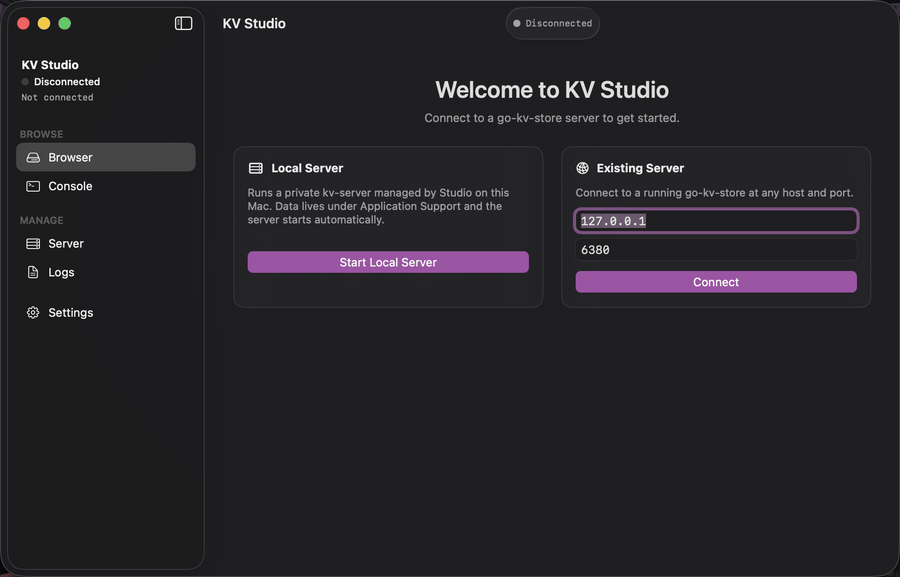
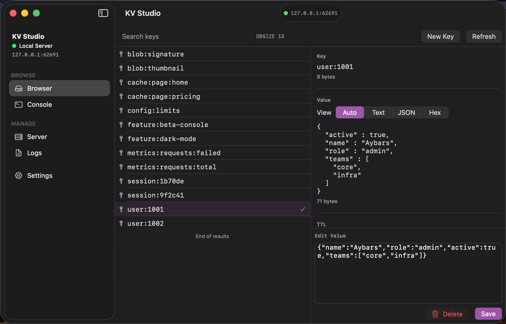
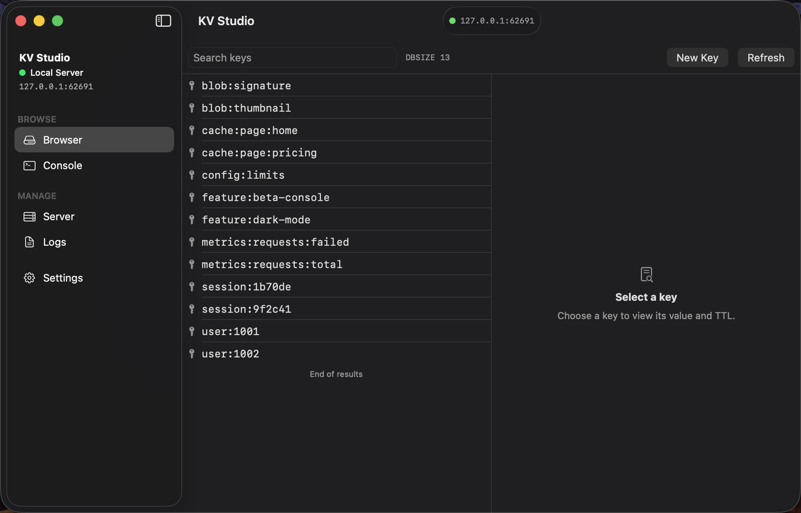
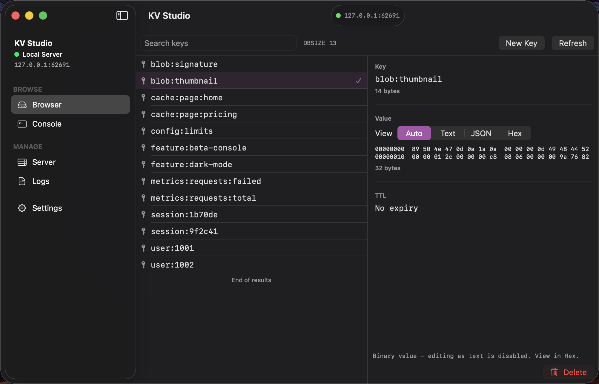
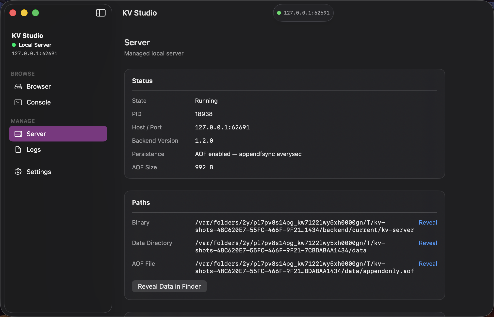

# KV Studio

A native macOS client and control plane for
[go-kv-store](https://github.com/Aybavs/go-kv-store).

Browse keys, inspect binary-safe values, run commands, manage a local `kv-server`, and watch its
logs — from one native Swift application.




## Install

Download the notarized `.dmg` from the [latest release](https://github.com/Aybavs/KV-Studio/releases/latest)
and drag KV Studio to Applications. A `kv-server` is bundled, so **Start Local Server** works with
nothing else installed.

## Features

- **Key browser** — infinite scrolling over `SCAN`, with server-side `MATCH` search
- **Value inspector** — Text, formatted JSON, or a hex dump, chosen automatically or by hand
- **Binary-safe** — arbitrary bytes round-trip without corruption
- **Built-in console** — send RESP2 commands and read the raw reply
- **Local server management** — start, stop, and restart a `kv-server` KV Studio owns
- **Existing servers** — connect to one you already run, probed for compatibility first
- **Live logs** — search, pause, and clear
- **Safe process ownership** — never signals a process it cannot prove is its own
- **Automatic updates** — SHA-256 verified, with rollback when a backend fails to start

## How it fits together

```
                    ┌─────────────────────┐
                    │      KV Studio      │
                    │       SwiftUI       │
                    └──────────┬──────────┘
                               │
              ┌────────────────┼────────────────┐
              │                │                │
              ▼                ▼                ▼
          Browser           Console           Logs
              │                │                │
              └────────────────┼────────────────┘
                               │
                         RESP2 / TCP
                               │
                               ▼
                    ┌─────────────────────┐
                    │      kv-server      │
                    │     go-kv-store     │
                    └─────────────────────┘
```

KV Studio speaks the server's RESP2 wire protocol directly from Swift, with no Redis client
dependency. The Browser and the Console get separate connections, so a long traversal never sits in
front of a command.

## Binary-safe by design

Keys and values are `Data` end to end and are never forced through `String`.

```
UTF-8 value  →  Text
JSON value   →  Formatted JSON
Binary data  →  Hex
```

`NUL`, `CRLF`, invalid UTF-8, and arbitrary bytes all round-trip unchanged — there are tests that
assert exactly that against a real server. Copying a value copies text when it is text and hex when
it is not, so no byte is lost to a replacement character. Keys can be created in Text or Hex.

## Local server or an existing one

**Local** — KV Studio runs one `kv-server` on `127.0.0.1:6380`, with `--appendonly` and
`--appendfsync everysec`.

- Owns the process it started and adopts its own server again after a crash
- Shuts it down gracefully when you quit
- Never takes over a port it does not own; it offers to connect instead
- Data lives under `~/Library/Application Support/KV Studio/`

**Existing** — give a host and port.

- Probed with `PING`, `DBSIZE`, and `SCAN 0 COUNT 1` before it is trusted
- A server that fails the probe is reported, not connected to
- Process controls and log capture are hidden for a server KV Studio does not manage
- Disconnect closes the connection and leaves the server running

## Screenshots

### Value inspector



### Key browser



### Hex viewer



### Server management



## Updates

KV Studio checks on launch or on demand, and nothing installs itself.

Every archive is verified against its published SHA-256 before it is unpacked. The backend is
updated first and compatibility-checked; one that fails to start is rolled back to the previous
working version automatically.

See [docs/updater.md](docs/updater.md) for the full flow.

## Build from source

Requires Xcode 16 or later.

```bash
git clone https://github.com/Aybavs/KV-Studio.git
cd KV-Studio
xcodebuild build -project KVStudio.xcodeproj -scheme KVStudio -configuration Debug
```

For a development backend:

```bash
./scripts/build-test-backend.sh    # builds .build/kv-server for the test suites
./scripts/install-dev-backend.sh   # installs one where the app looks for it
```

### Tests

The unit and integration suites are a plain `xcodebuild` call. Several of them start a real
`kv-server`, so build the test backend above first or they skip themselves.

```bash
xcodebuild test -project KVStudio.xcodeproj -scheme KVStudio -configuration Debug -only-testing:KVStudioTests
```

The end-to-end suite has to go through its script:

```bash
./scripts/run-ui-tests.sh
```

Xcode signs the UI-test runner from its own template, which sandboxes it without permission to
listen. Five scenarios start a server of their own, and both the runner and everything it spawns
are refused, so the script re-signs the runner between building and running. Quit any Xcode Run
session first: a debugger-attached app cannot be replaced by the runner, and the suite stops with
that reason rather than working around it.

## Limitations

- macOS only
- One managed local server at a time
- No custom data directory
- No TLS or authentication UI
- No RESP3, no cluster UI, no Pub/Sub
- Not a general Redis client — compatibility is decided by capability, so other servers offering
  `PING`, `DBSIZE`, and `SCAN` may connect, but nothing beyond that is supported

## Documentation

- [Architecture](docs/architecture.md)
- [Updater and rollback](docs/updater.md)
- [Privacy and security](docs/security.md)
- [Troubleshooting](docs/troubleshooting.md)

## License

MIT — see [LICENSE](LICENSE). The bundled `kv-server` comes from
[go-kv-store](https://github.com/Aybavs/go-kv-store), which is MIT as well; Sparkle is under its own
MIT-style licence.
